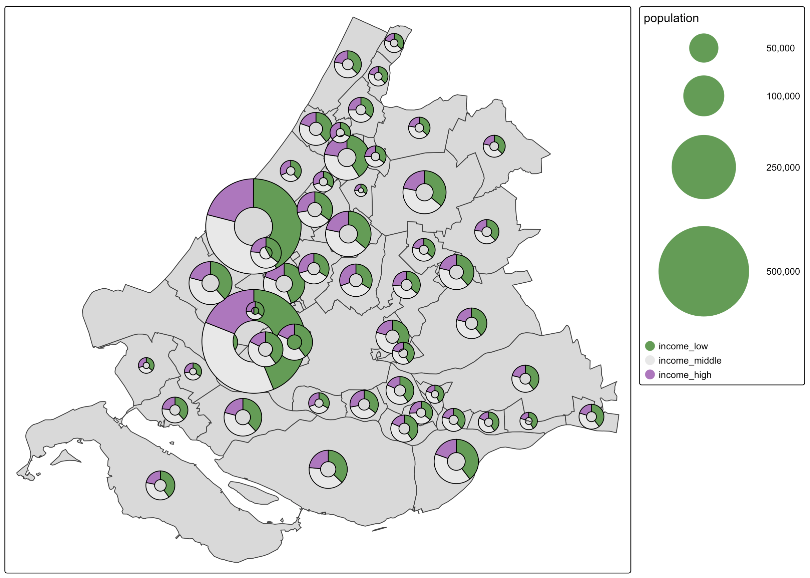
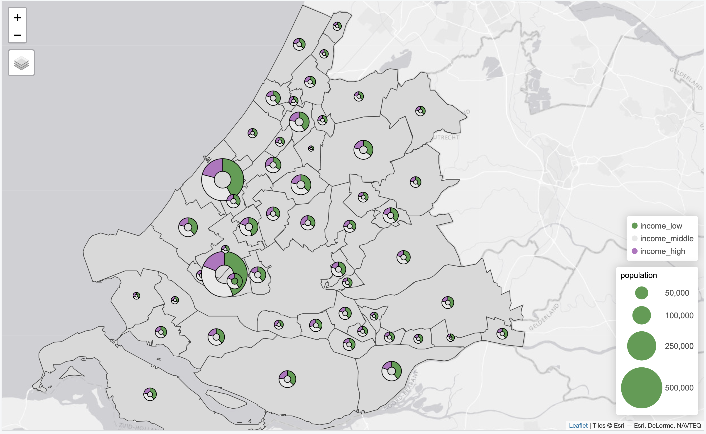

# tmap.glyphs

A new layer! tmap contains a standard set of layer functions, `tm_polygons()`, `tm_symbols()`, etc.
This extension package features a new layer function, `tm_donuts`. In the future, more layer functions are expected, e.g. `tm_pies`.

The aim of this package is not just the extension itself, but also an example of how tmap can be extended.

Note: this package is still a bit slow, because the donuts are rendered using `ggplot2`. Using the `grid` package directly would improve the running time.


What are glyphs?
-----------

Generally speaking, a glyph is visual representation. One of the oldest examples are Egyptian hieroglyphs.

In the context of thematic maps, glyphs are small visualizations plotted at specific geographic locations, which are typically spatial points or spatial polygons. In the latter case, centroids are computed (just like `tm_symbols`).


Installation
------------

```r
# install.packages("remotes")
install_github("r-tmap/tmap")
install_github("r-tmap/tmap.deckgl")
```

Example
------------


```r
library(tmap)
library(tmap.glyphs)

data(NLD_muni)

ZH_muni = NLD_muni[NLD_muni$province == "Zuid-Holland", ]
ZH_muni$income_middle = 100 - ZH_muni$income_high - ZH_muni$income_low
```

The plot uses an additional visual variable, called `parts`. This should be specified by `tm_vars` with `multivariate = TRUE`.

```r
tm_shape(ZH_muni) +
	tm_polygons() +
	tm_donuts(parts = tm_vars(c("income_low", "income_middle", "income_high"), multivariate = TRUE),
			  fill.scale = tm_scale_categorical(values = "-pu_gn_div"),			  
			  size = "population",
			  size.scale = tm_scale_continuous(ticks = c(50000, 100000, 250000, 500000)))	
```

Plot mode:



View mode:



