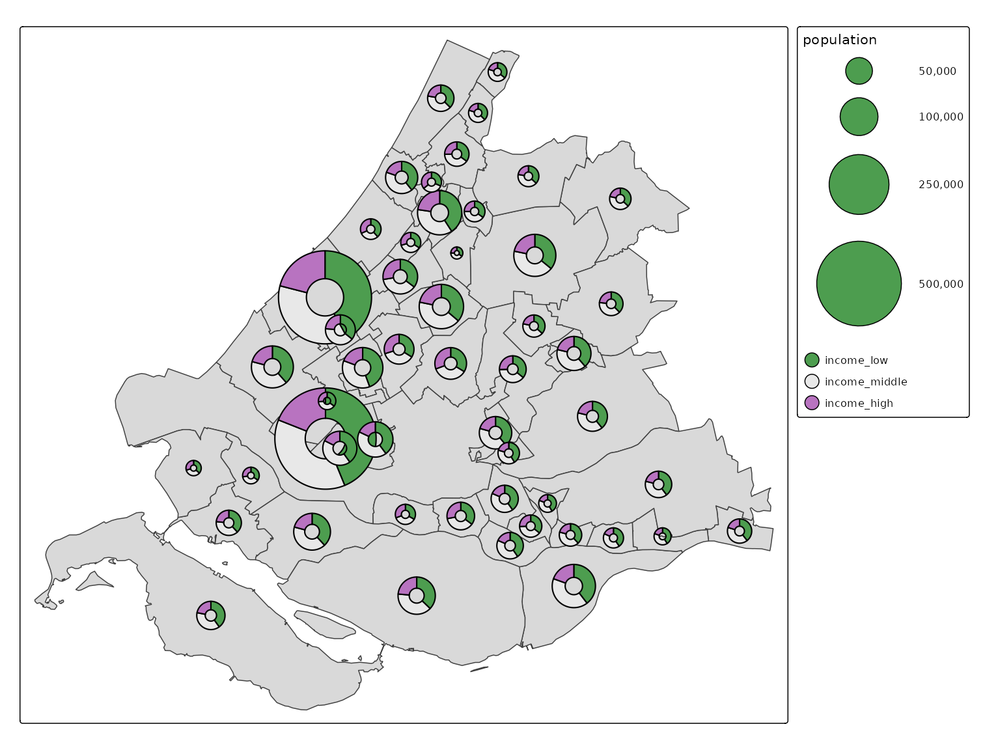
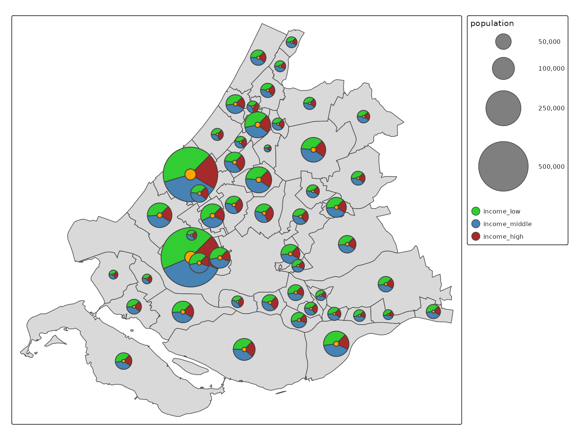

# Donut and pie maps

Glyphs in spatial data visualization are graphical symbols that
represent data values at specific geographic locations. Each glyph can
encode multiple data variables.

With the extension package
[**tmap.glyphs**](https://github.com/r-tmap/tmap.glyphs/) (in
development) glyphs can be created. Currently the donut, the pie and the
flower glyphs are implemented. More will follow.

In this example we explore the proportion of low, middle and high
incomes in Zuid-Holland, a province of the Netherlands (including The
Hague and Rotterdam). We use the dataset `NLD_muni` from `tmap`, where
we apply a filter and subsequently derive the percentage of middle
income:

``` r
ZH_muni = NLD_muni[NLD_muni$province == "Zuid-Holland", ]
ZH_muni$income_middle = 100 - ZH_muni$income_high - ZH_muni$income_low
```

## Pie maps

Pie maps are (just) a special case of donut maps.

``` r
tm_shape(ZH_muni) +
  tm_polygons() +
  tm_pies(parts = tm_vars(c("income_low", "income_middle", "income_high"), multivariate = TRUE),
    fill.scale = tm_scale_categorical(values = "-pu_gn_div"),             
    size = "population",
    lwd = 1,
    size.scale = tm_scale_continuous(ticks = c(50000, 100000, 250000, 500000)))
```


Explanation:

- The visual variable `parts` is needed to determine the cut the pies.
  Note that a multivariate variable is required (see
  [vignette](https://r-tmap.github.io/tmap/articles/adv_multivariate)).
- The fill colors of the parts are specified via `fill.scale` (and not
  via `parts`). The used scale should be a categorical; each part
  represents a category.
- The visual variable `size` represents the overall sizes of the pies.

## Donut maps

Pies are just a specific case of the more general donuts.

``` r
tm_shape(ZH_muni) +
  tm_polygons() +
  tm_donuts(
    parts = tm_vars(c("income_low", "income_middle", "income_high"), multivariate = TRUE),
    fill.scale = tm_scale_categorical(values = "-pu_gn_div"),             
    size = "population",
    lwd = 1,
    size.scale = tm_scale_continuous(ticks = c(50000, 100000, 250000, 500000)))
```



Via the argument `options`, several properties of the donuts can be
specified:

``` r
tm_shape(ZH_muni) +
  tm_polygons() +
  tm_donuts(
    parts = tm_vars(c("income_low", "income_middle", "income_high"), multivariate = TRUE),
    fill.scale = tm_scale_categorical(values = c("limegreen", "steelblue", "brown"), value.neutral = "grey50"),           
    size = "population",
    lwd = 1,
    size.scale = tm_scale_continuous(ticks = c(50000, 100000, 250000, 500000)),
    options = opt_tm_donuts(start = 45, direction = -1, inner = 0.2, fill_hole = "orange"))
```



Explanation:

- `value.neutral` is used for legends of other visual variables (in this
  case size). See [vignette on neutral
  values](https://r-tmap.github.io/tmap/articles/adv_legends#neutral-values)
- For each tmap layer, `options` is used for option specific settings.
  The default list is obtained via `opt_tm_<layer>`.
