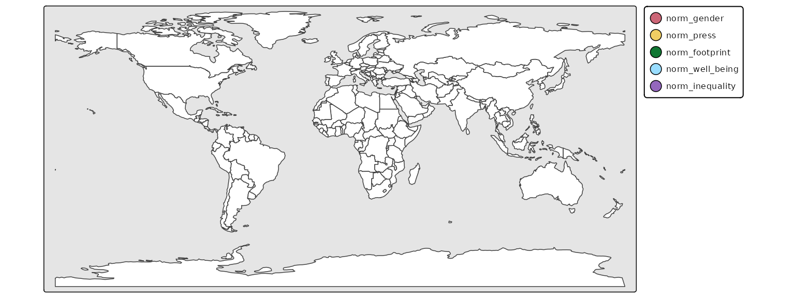

# Flower maps

## Flower maps

``` r
library(sf)
#> Linking to GEOS 3.12.1, GDAL 3.8.4, PROJ 9.4.0; sf_use_s2() is TRUE

q = function(x) {
    r = rank(x)
    r[is.na(x)] = NA
    r = r / max(r, na.rm = TRUE)
    r
}

World$norm_well_being = q((World$well_being / 8))
World$norm_footprint = q(((50 - World$footprint) / 50))
World$norm_inequality = q(((65 - World$inequality) / 65))
World$norm_press = q(1 - ((100 - World$press) / 100))
World$norm_gender = q(1 - World$gender)


tm_shape(World) +
    tm_polygons(fill = "white", popup.vars = FALSE) +
tm_shape(World) +   
    tm_flowers(parts = tm_vars(c("norm_gender", "norm_press", "norm_footprint", "norm_well_being", "norm_inequality"), multivariate = TRUE),
               fill.scale = tm_scale(values = "friendly5"),
               size = 1, popup.vars = c("norm_gender", "norm_press", "norm_footprint", "norm_well_being","norm_inequality"), id = "name") +
    tm_basemap(NULL) +
    tm_layout(bg.color = "grey90")
#> [tip] Consider a suitable map projection, e.g. by adding `+ tm_crs("auto")`.
#> This message is displayed once per session.
```


